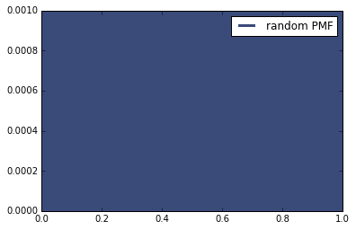
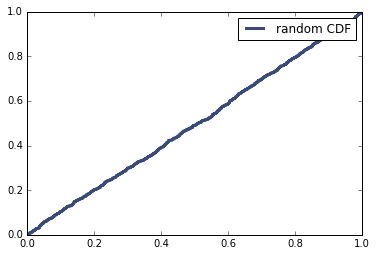

[Think Stats Chapter 4 Exercise 2](http://greenteapress.com/thinkstats2/html/thinkstats2005.html#toc41) (a random distribution)

> The PMF looks like a filled rectangle with a height of 0.001 because each of its 1000 values is unique, so every one has a 1/1000=0.001 frequency.

> (It's possible but unlikely that you could get the same random number more than once, but it didn't happen here).

> 

> ***

> The CDF is approximately a straight line, indicating that the distribution is indeed random/uniform.

> 
